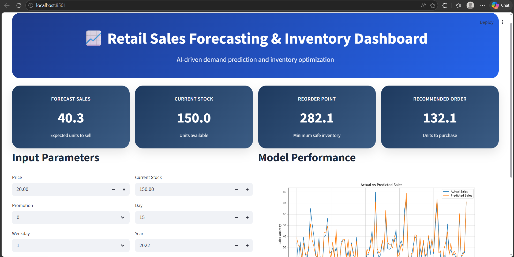
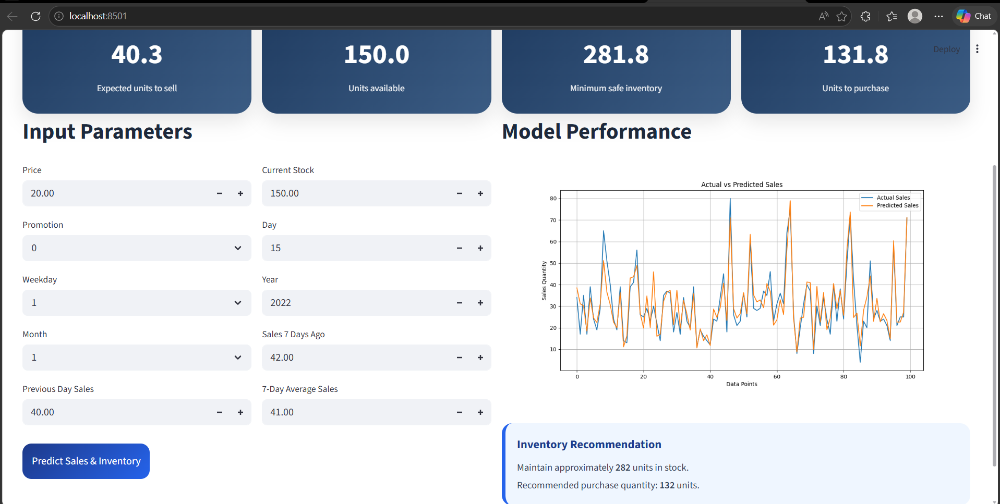
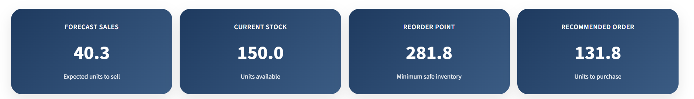
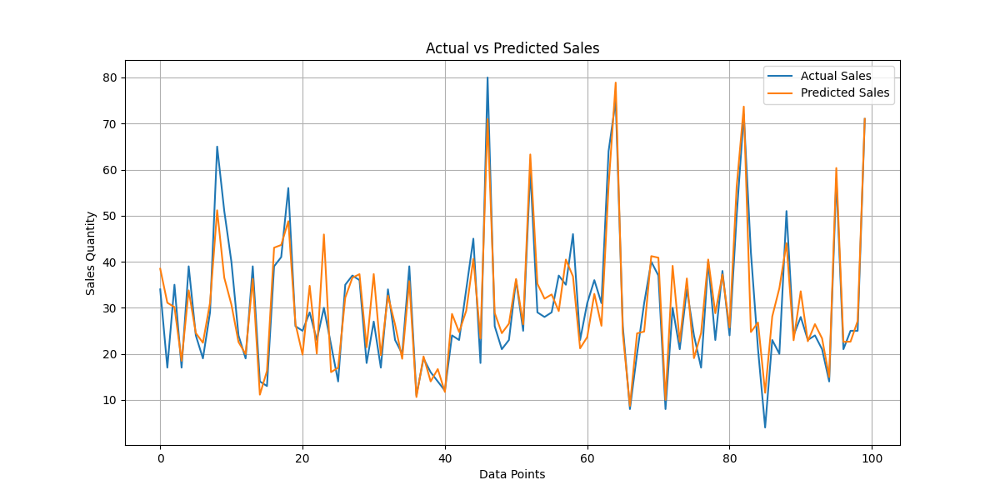
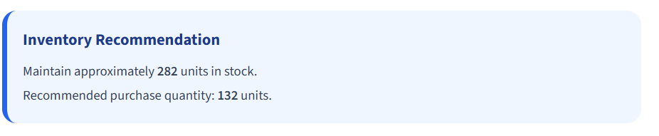

# Retail Sales Forecasting & Inventory Optimization System

## Project Overview

Retail businesses often struggle to maintain the correct inventory levels. If too much stock is stored, it increases storage and holding costs. If too little stock is available, products go out of stock and businesses lose sales.

This project solves that problem by using Machine Learning to predict future product demand and recommend the correct inventory levels.

The system forecasts future sales using historical retail data and then calculates:

* Reorder Point
* Safety Stock
* Recommended Order Quantity

This project simulates how companies such as Amazon, Walmart, Flipkart, Reliance Retail, D-Mart, and BigBasket use sales forecasting and inventory optimization to improve their business operations.

---

## Problem Statement

Retail companies need to know:

* How much stock should be maintained?
* When should inventory be reordered?
* How many units should be purchased?

Without proper forecasting:

* Overstocking increases cost
* Understocking causes stockouts and lost sales
* Inventory planning becomes inefficient

The objective of this project is to build an end-to-end system that:

1. Predicts future sales demand
2. Calculates optimal inventory levels
3. Prevents stock shortages and overstocking
4. Supports better business decisions

---

## Industry Relevance

Retail and e-commerce companies use forecasting systems to:

* Predict future product demand
* Plan inventory in advance
* Improve customer satisfaction
* Reduce warehouse cost
* Increase profit

Companies such as Amazon, Walmart, Flipkart, Reliance Retail, D-Mart, and BigBasket use similar systems in their supply chain and inventory planning process.

---

## Features

* Historical retail sales analysis
* Data preprocessing and cleaning
* Feature engineering
* Sales forecasting using Machine Learning
* Inventory optimization logic
* Reorder Point calculation
* Safety Stock calculation
* Recommended Order Quantity generation
* Interactive Streamlit dashboard
* KPI cards and business insights
* Actual vs Predicted sales visualization
* Inventory recommendation output

---

## Tech Stack

* Python
* Pandas
* NumPy
* Scikit-learn
* Joblib
* Matplotlib
* Streamlit

---

## Project Workflow

1. Load historical retail sales data
2. Clean and preprocess the dataset
3. Perform exploratory data analysis
4. Create forecasting features such as:

   * Previous day sales
   * Sales 7 days ago
   * Rolling average sales
5. Train the machine learning model
6. Predict future sales demand
7. Calculate inventory metrics:

   * Safety Stock
   * Reorder Point
   * Recommended Order Quantity
8. Display results in a Streamlit dashboard

---

## Machine Learning Model Used

This project uses a Random Forest Regressor model because:

* It works well for sales prediction
* It can handle non-linear relationships
* It is beginner-friendly
* It provides good accuracy without requiring advanced tuning

Input features used:

* Price
* Promotion
* Weekday
* Month
* Day
* Year
* Previous Day Sales
* Sales 7 Days Ago
* 7-Day Average Sales

Target:

* Predicted Sales Quantity

---

## Inventory Optimization Logic

After forecasting sales, the project calculates:

### Safety Stock

Additional stock maintained to avoid stockouts.

### Reorder Point

The stock level at which new inventory should be ordered.

Formula:

Reorder Point = Predicted Sales × Lead Time

### Recommended Order Quantity

Recommended Order = Reorder Point − Current Stock

If current stock is already sufficient, recommended order becomes 0.

---

## KPI Metrics Displayed

The dashboard shows these business KPIs:

* Forecast Sales
* Current Stock
* Reorder Point
* Recommended Order Quantity

---

## Project Structure

```text
Retail-Sales-Forecasting-Inventory-Optimization/
│
├── app/
│   └── streamlit_app.py
│
├── data/
│   └── raw/
│       └── retail_sales_sample.csv
│
├── models/
│   └── retail_forecast_model.pkl
│
├── outputs/
│   ├── forecast_results.csv
│   └── inventory_recommendations.csv
│
├── images/
│   ├── dashboard.png
│   ├── kpi_cards.png
│   ├── actual_vs_predicted.png
│   ├── inventory_recommendation.png
│   └── final_dashboard.png
│
├── src/
│   ├── data_preprocessing.py
│   ├── feature_engineering.py
│   ├── inventory_logic.py
│   ├── train_model.py
│   └── visualize.py
│
├── README.md
├── requirements.txt
├── .gitignore
└── main.py

```

---

## Installation Steps

### Windows

```bash
python -m venv venv
venv\Scripts\activate
pip install -r requirements.txt
streamlit run app/streamlit_app.py
```

### Mac/Linux

```bash
python3 -m venv venv
source venv/bin/activate
pip install -r requirements.txt
streamlit run app/streamlit_app.py
```

---

## Requirements

```text
streamlit
pandas
numpy
scikit-learn
joblib
matplotlib
```

---

## How to Run the Project

1. Clone or download the repository
2. Open the project folder in VS Code
3. Install the required libraries
4. Run the Streamlit dashboard

```bash
streamlit run app/streamlit_app.py
```

5. Open the local URL shown in the terminal
6. Enter retail input values
7. Click "Predict Sales and Inventory"
8. View forecast and inventory recommendations

---

## Sample Output

Example Dashboard Output:

* Forecast Sales: 40.3 units
* Current Stock: 150 units
* Reorder Point: 282.1 units
* Recommended Order: 132.1 units

---

## Dashboard Screenshots

### Dashboard Home



### KPI Cards



### Actual vs Predicted Graph



### Inventory Recommendation



---

## Business Value

This project helps businesses:

* Reduce inventory holding cost
* Avoid stockouts
* Improve customer satisfaction
* Increase sales
* Optimize inventory planning
* Make better supply chain decisions

---

## Learning Outcomes

Through this project, I learned:

* Data preprocessing
* Exploratory Data Analysis
* Feature Engineering
* Machine Learning for forecasting
* Inventory optimization logic
* Streamlit dashboard development
* GitHub project documentation
* Real-world business problem solving

---


### Planned Enhancements

* Multi-store forecasting support
* Product-level forecasting for multiple SKUs
* Region-wise demand prediction
* Promotional campaign and discount impact modeling
* Price elasticity analysis
* Weather-based forecasting
* Holiday and festival sales prediction
* Real-time dashboard updates
* Automatic purchase order generation
* Low stock alerts and reorder alerts
* Downloadable Excel and PDF reports
* Integration with ERP systems such as SAP or Oracle
* Cloud deployment using Streamlit Cloud, AWS, or Heroku
* Role-based access for store managers and analysts
* Inventory anomaly detection

### Advanced Machine Learning Improvements

* Use ARIMA for time-series forecasting
* Use Prophet for seasonality forecasting
* Use XGBoost for higher forecasting accuracy
* Use LSTM for deep learning-based prediction
* Build ensemble forecasting models
* Add feature importance and explainability

### Future Business Extensions

* Supplier lead time optimization
* Demand forecasting for different cities and regions
* Warehouse-wise inventory planning
* Category-wise and brand-wise sales prediction
* Integration with a database such as MySQL or PostgreSQL
* Chatbot for answering questions such as:

  * How much stock should be ordered?
  * Which product is likely to go out of stock?
  * Which product category is growing fastest?


## Author

Swetha K

